# **Vehicle Detection Project** 

## Writeup

The goals / steps of this project are the following:
* Perform a Histogram of Oriented Gradients (HOG) feature extraction on a labeled training set of
images and train a classifier Linear SVM classifier, Apply a color transform and append binned color
features, as well as histograms of color, to your HOG feature vector.
* Implement a sliding-window technique and use your trained classifier to search for vehicles.
* Run pipeline on a video stream (start with the test_video.mp4 and later implement on full
project_video.mp4) and create a heat map of recurring detections frame by frame to reject outliers and
follow detected vehicles.
* Estimate a bounding box for vehicles detected.

## Images

### Image-1
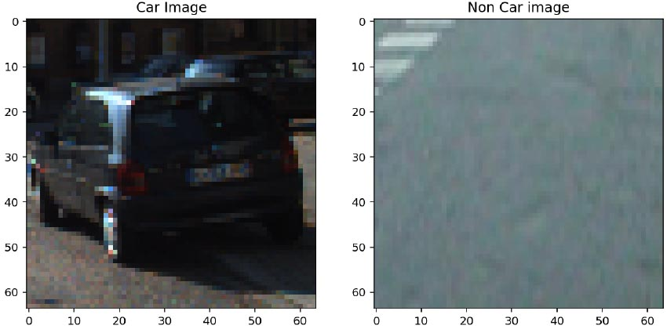

### Image-2
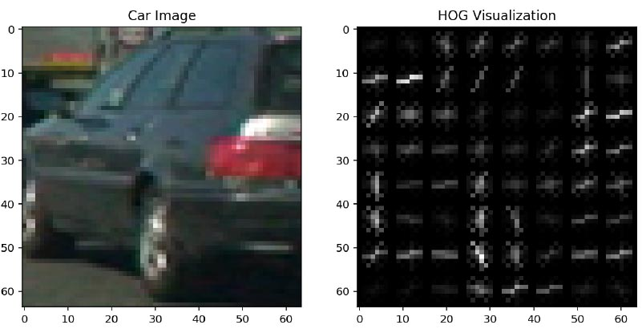

### Image-3
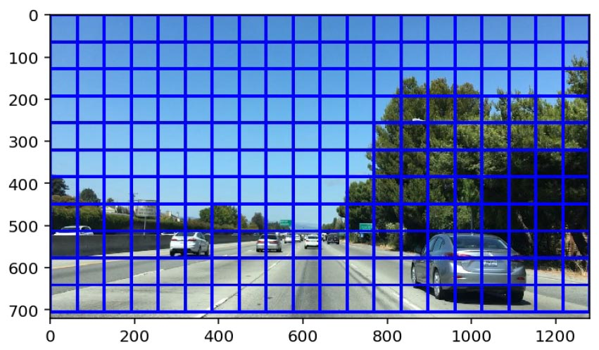

### Image-4
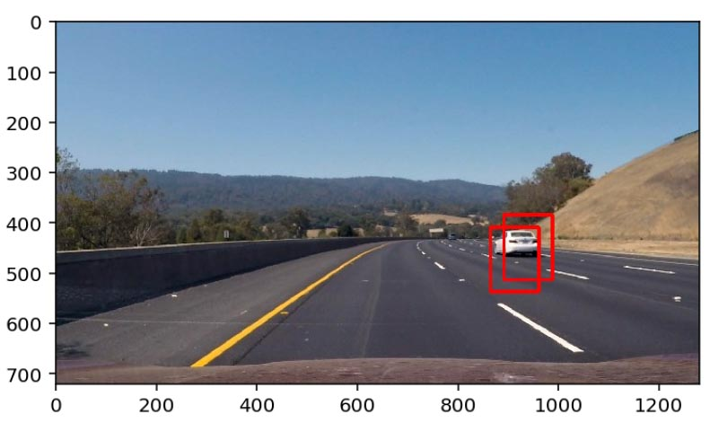

### Image-5
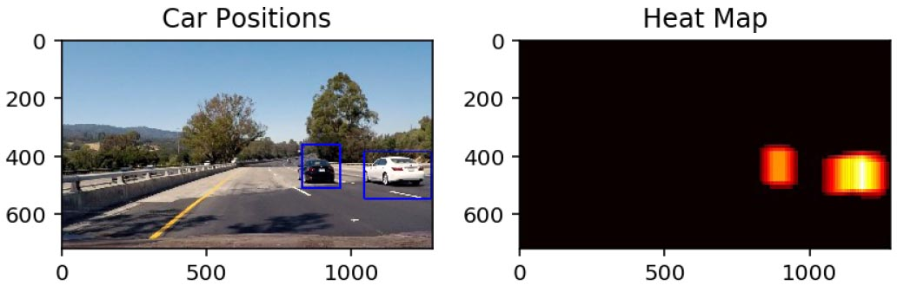

## RUBRIC
REFERENCE: Udacity coursework and Quizzes (Vehicle Detection)

## Histogram of Oriented Gradients (HOG)

1. Explain how (and identify where in your code) you extracted HOG features from the training images.

The code for this step is contained in the third and fourth code cell of the IPython notebook under sckitlearn
HOG extraction. I started by reading in all the `vehicle` and `non-vehicle` images. Here is an
example of one of each of the `vehicle` and `non-vehicle` classes:

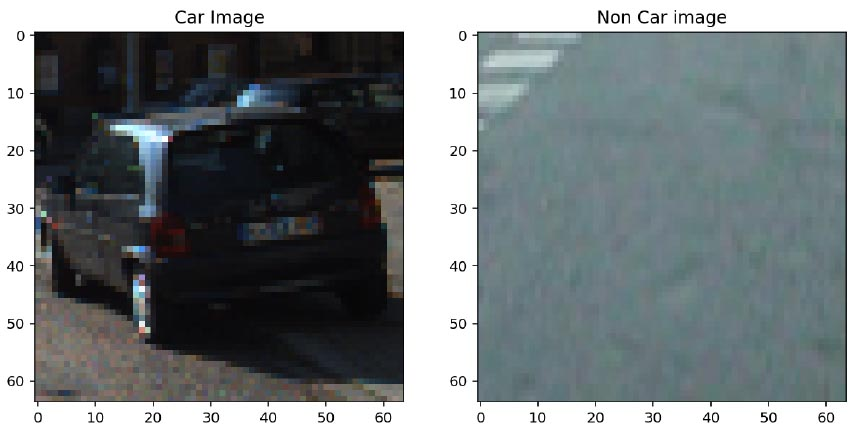

Used get_hog_features() to obtain HOG features.

2. Explain how you settled on your final choice of HOG parameters.

orient = 9
pix_per_cell = 8
cell_per_block = 2

These parameters were selected similar to the examples covered in the coursework and finetuned for
this application.
I tried various combinations of parameters. RGB gave better accuracy than HSL, HSV and other color
spaces. Parameters were varied for more accurate predictions.

3. Describe how (and identify where in your code) you trained a classifier using your selected HOG
features (and color features if you used them).

I trained a linear SVC after cell 6. The LinearSVC() function is used for the linear SVC.
svc.fit(X_train, y_train) is used for fitting the model. These were the results:

<I>Using spatial binning of: 32 and 32 histogram bins 
Feature vector length: 3168 
62.14 Seconds to train SVC... 
Test Accuracy of SVC = 0.92</I>

For HOG classification:

<I>Using: 9 orientations 8 pixels per cell and 2 cells per block 
Feature vector length: 1764 
0.24 Seconds to train SVC... 
Test Accuracy of SVC = 0.965 
My SVC predicts: [ 0. 1. 0. 0. 1. 1. 0. 1. 0. 0.] 
For these 10 labels: [ 0. 1. 0. 0. 1. 1. 0. 1. 0. 0.]</I>

For Search and classification: (accuracy of 99% is obtained.)

<I>Using: 9 orientations 8 pixels per cell and 2 cells per block 
Feature vector length: 2580 
0.17 Seconds to train SVC... 
Test Accuracy of SVC = 0.99</I>

## Sliding Window Search

1. Describe how (and identify where in your code) you implemented a sliding window search. How
did you decide what scales to search and how much to overlap windows?

Sliding window search is implemented after cell 8. Used getSVC_Xscaler to obtain the X scales. I
started with 0.5 as xy_overlap and modified the xy_window to get better results. I used same size
windows to optimize the performance.

2. Show some examples of test images to demonstrate how your pipeline is working. What did you do
to optimize the performance of your classifier?

Example test images obtained from pipeline are shown later. Used SVC classifier and modified the
parameters to get better test accuracy, used heatmaps on the windowed images to obtain the no. of cars
present in vicinity. Used other color spaces and compared the performance to find the suitable color
space suitable for this project.

## Video Implementation

1. Provide a link to your final video output. Your pipeline should perform reasonably well on the entire
project video (somewhat wobbly or unstable bounding boxes are ok as long as you are identifying the
vehicles most of the time with minimal false positives.)

2. Describe how (and identify where in your code) you implemented some kind of filter for false
positives and some method for combining overlapping bounding boxes.

Filter for false positives is under “Multiple Detections and False Positives” is after cell 9.
I recorded the positions of positive detections in each frame of the video. From the positive detections
I created a heatmap and then thresholded that map to identify vehicle positions. I then assumed each
blob corresponded to a vehicle. I constructed bounding boxes to cover the area of each blob detected.

The function find_hot_windows(image, svc, X_scaler) returns the hot maps for vehicle detection using
the svc and X_scaler valued obtained from getSVC_Xscalar(images).

### Here are six frames and their corresponding heatmaps:

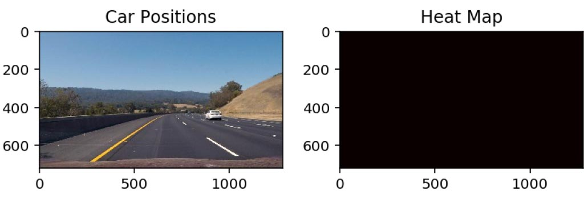
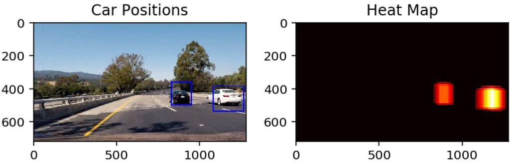
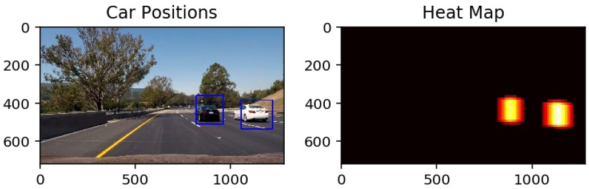
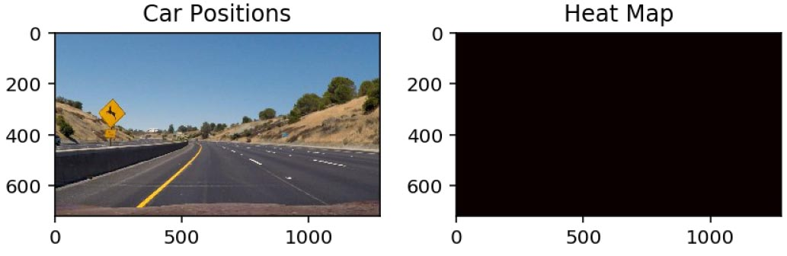
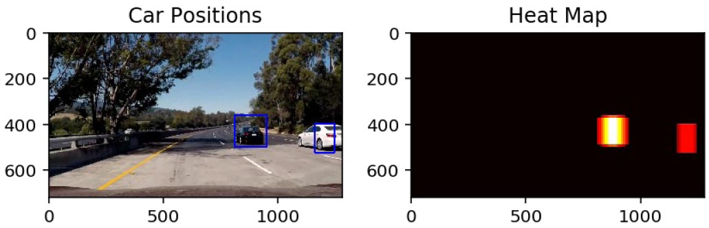
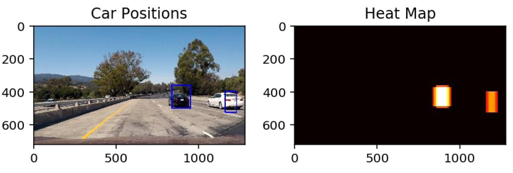

### Here the resulting bounding boxes are drawn onto the last frame in the series:

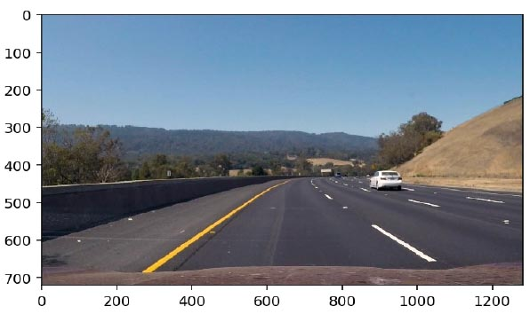
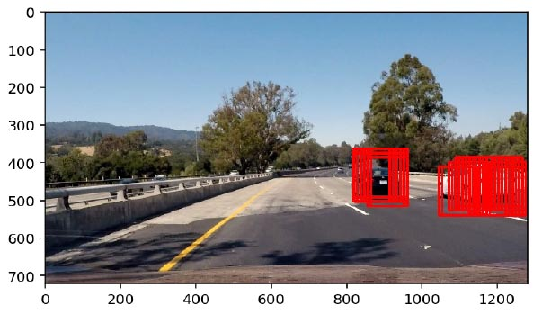
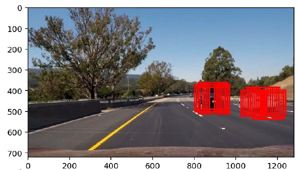
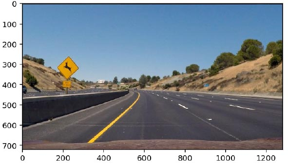
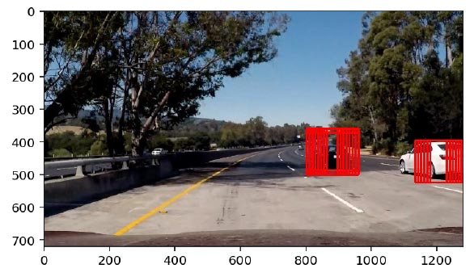
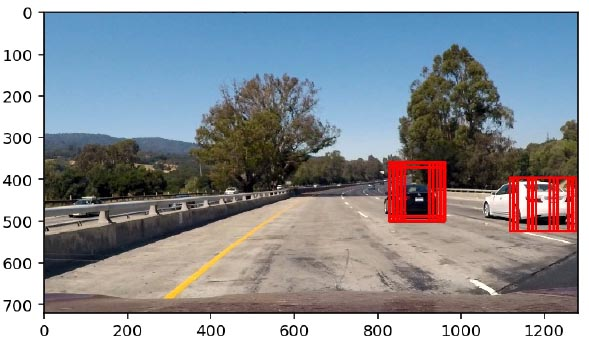

## Discussion

1. Briefly discuss any problems / issues you faced in your implementation of this project. Where will
your pipeline likely fail? What could you do to make it more robust?

The pipeline works well on images on vehicle detection. The only concern is that when the cars are far
away they are not recognized. But all the cars in proximity are identified. There is a slight miss in
recognizing the car with a frame of two with no boxes, but they resume.

To improve the pipeline I can tweak around the slidign window parameters more so cars a distance can
also be recognized. Have smaller oxes above in the image. This would help with the detection of cars at
a distance.
